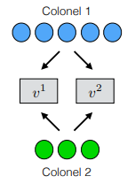

# CS_5370_Algorithmic_Game_Theory_Project

## Introduction

The Colonel Blotto game is a two-player, non-zero sum game in which each player allocates resources across multiple battlefields to maximize their chances of winning. The game is named after Colonel Blotto, a fictional character who was known for dividing his army into small units and sending them to different battlefields to achieve victory.

In the game, each player has a fixed amount of resources, which they allocate across a fixed number of battlefields. The players simultaneously choose their allocation strategies, and the winner of each battlefield is determined by the player who allocated the most resources to that battlefield. The winner of the game is the player who wins the majority of the battlefields.

The game is often used to model situations where two parties are competing for limited resources, such as in military conflicts, political elections, or even business competition. The Colonel Blotto game has been extensively studied in game theory and has many interesting properties, including the existence of equilibrium strategies and the fact that the game is not always zero-sum.

The following image is a small example of the Colonel Blotto game, courtesy of Dr. Keith Paarporn at UCCS.

## How to Run This Source

### TLDR

Adjust or add to any of the `scenario...` functions in the [`main.py`](main.py) file and run that script to see the various values of varying scenarios!

### Assignment Permutations

Run [this](assignment_permutations.py) file to see how to achieve varying number of assignments as a function of *number of troops* and *number of battlefields*.

### Cost Matrix

Run [this](cost_matrix.py) file to see how different cost matrices are computed as a function of *Colonel x number of troops* and *battlefield i weight*.

### Pessimistic Strategies

Run [this](pessimistic_strategies.py) file to see what is the best action for a given cost matrix in the form of *n x m* where *n* and *m* don't have to be equal to each other.

### Mixed Strategy Nash Equilibria

Run [this](mixed_nash_equilibra.py) file to see what is the probability distribution with which each colonel should choose each strategy.
Similar to the Pessimistic Strategies this takes a cost matrix in the form of *n x m* where *n* and *m* don't have to be equal to each other.

### Weakest Link Game

The Weakest Link game is similar to the Colonel Blotto game with the exception of how the winner is determined. In the Weakest Link game if any Colonel 1 is "defending" while Colonel 2 is "attacking", if ANY battlefield is lost to Colonel 2, Colonel 1 looses the game. The [weakest_link_cost_matrix.py](weakest_link_cost_matrix.py) takes the output of the [cost_matrix.py](cost_matrix.py) and returns a new structure implementing the previous rule. Using this new from of the cost matrix it can be fed into the [MSNE](mixed_nash_equilibra.py) to calculate the probability distribution with which any Colonel should choose a strategy. 

### Main

Run [this](main.py) file to see how all the previous algorithms work with each other to compute the final values and the best action for each colonel.

Feel free to adjust or add to any of the `scenario...` functions to see how varying number of troops and weights can affect the actions and values!.